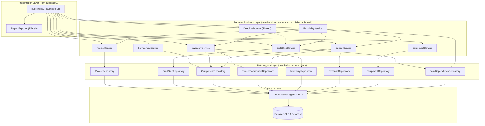
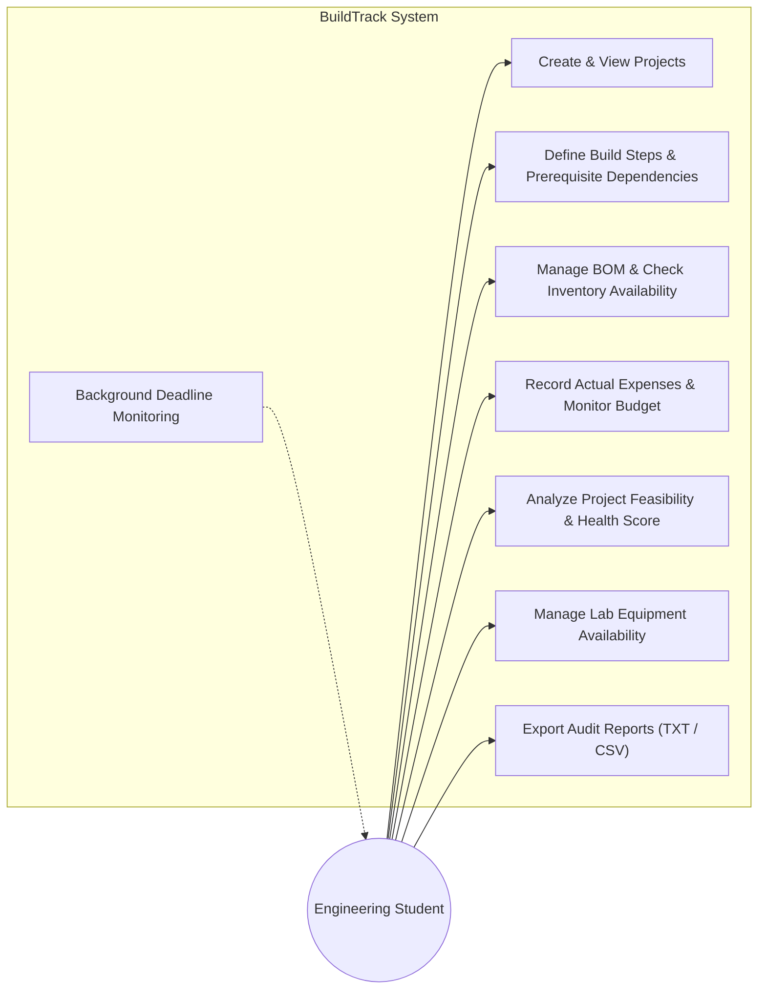
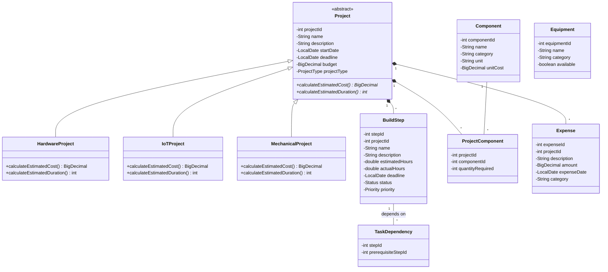
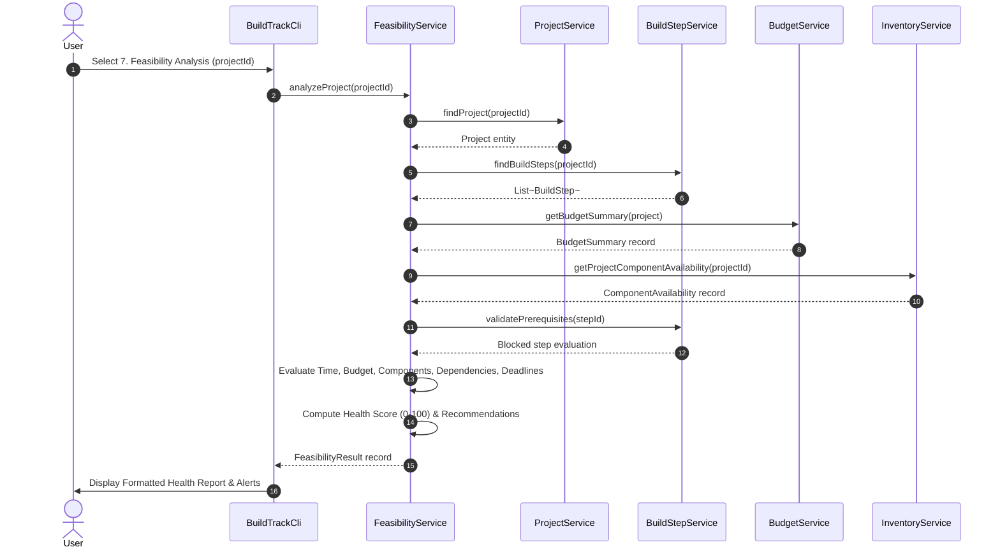
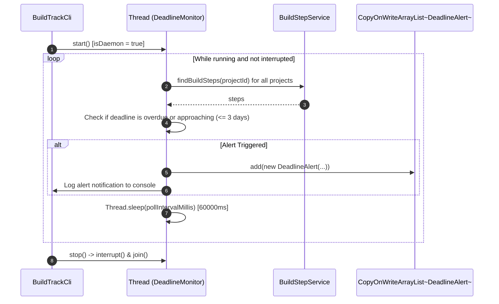

# BuildTrack System Architecture & Design Documentation

## 1. System Overview & Architectural Pattern
BuildTrack is structured around a classic **4-Tier Layered Architecture** emphasizing strict separation of concerns, high cohesion, and loose coupling.

---

## 2. Layer Responsibilities

### 1. Presentation Layer (`com.buildtrack.ui`)
- **`BuildTrackCli`**: Manages the terminal console loop, presents structured menus, validates user input (integers, big decimals, dates), catches business and SQL exceptions gracefully, and formats tabular data.
- **`ReportExporter`**: Handles file output operations, generating human-readable audit text reports (`.txt`) and comma-separated value spreadsheets (`.csv`) in the `reports/` folder.

### 2. Business Logic / Service Layer (`com.buildtrack.service` & `com.buildtrack.threads`)
- **`ProjectService`**: Validates project attributes (name, dates, budget non-negativity) and handles project lifecycle operations.
- **`BuildStepService`**: Manages step progress calculation, status transitions, prerequisite checks, and cycle detection.
- **`ComponentService`**: Validates component definitions and pricing before catalog entry.
- **`InventoryService`**: Computes component availability for projects, reconciles BOM requirements against stock, and generates itemized procurement purchase lists.
- **`BudgetService`**: Computes total required funds (BOM costs + recorded expenses), calculates remaining budget and utilization percentages, and assigns warning statuses.
- **`FeasibilityService`**: Runs multi-metric feasibility analysis (time, budget, components, dependencies, deadlines) and computes a composite Health Score (0–100) with actionable recommendations.
- **`EquipmentService`**: Coordinates lab machinery registration and operational availability state.
- **`DeadlineMonitor`**: Implements `Runnable` in an autonomous background thread to periodically scan build step deadlines and record `DeadlineAlert` entities.

### 3. Data Access Layer (`com.buildtrack.repository`)
- Provides clean CRUD interfaces for relational entities using pure JDBC `PreparedStatement` queries and mapping result sets into domain model objects.
- Handles SQL parameterization, preventing SQL injection vulnerabilities.

### 4. Database Layer (`com.buildtrack.database` & PostgreSQL)
- **`DatabaseManager`**: Centralizes JDBC connection lifecycle management, retrieving database credentials securely from environment variables.
- **PostgreSQL 18**: Relational persistence engine enforcing data integrity with primary keys, identity columns, foreign keys (`ON DELETE CASCADE` / `ON DELETE RESTRICT`), and check constraints.

---

## 3. Use Case Diagram

---

## 4. Class & Component Diagram

---

## 5. Sequence Diagram: Feasibility Analysis Workflow

---

## 6. Background DeadlineMonitor Thread Flow

---

## 7. Report Generation Flow
1. User requests report generation for a project from the CLI.
2. `BuildTrackCli` invokes `budgetService.getBudgetSummary()`, `feasibilityService.analyzeProject()`, `buildStepService.findBuildSteps()`, `inventoryService.generatePurchaseList()`, and `expenseRepository.findByProjectId()`.
3. `ReportExporter` creates the `reports/` directory if absent via `java.nio.file.Files.createDirectories`.
4. `ReportExporter.exportToTxt()` formats a complete plain-text audit document via `PrintWriter` and `BufferedWriter`.
5. `ReportExporter.exportToCsv()` formats a tabular CSV export using escaped strings and comma delimiters.
6. The CLI displays absolute file paths confirming successful disk persistence.

