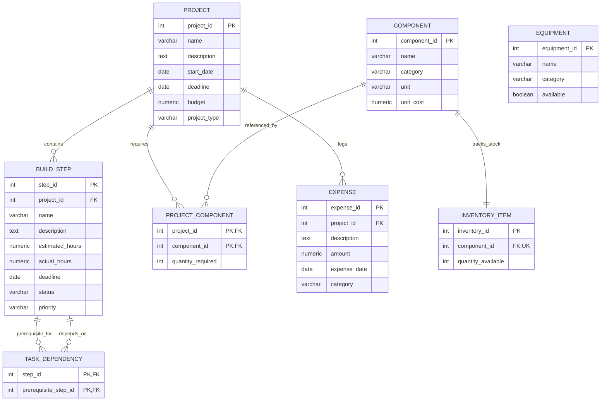

# BuildTrack Database Schema & Relational Model

## 1. Overview
BuildTrack uses a normalized relational data model hosted on **PostgreSQL 18**. The schema consists of 8 interconnected tables that enforce domain integrity through primary keys, foreign keys with cascading actions, and database-level check constraints.

---

## 2. Entity-Relationship Diagram

---

## 3. Table Details & Field Specifications

### 1. `project`
Represents an engineering project instance.
| Column | Type | Constraints | Description |
| :--- | :--- | :--- | :--- |
| `project_id` | `INTEGER` | `GENERATED ALWAYS AS IDENTITY PRIMARY KEY` | Auto-incrementing project ID |
| `name` | `VARCHAR(150)` | `NOT NULL` | Project title |
| `description` | `TEXT` | `NOT NULL DEFAULT ''` | Project description |
| `start_date` | `DATE` | Nullable | Planned start date |
| `deadline` | `DATE` | Nullable | Planned completion deadline |
| `budget` | `NUMERIC(12,2)` | `NOT NULL CHECK (budget >= 0)` | Allocated base budget |
| `project_type` | `VARCHAR(20)` | `NOT NULL CHECK (project_type IN ('HARDWARE', 'MECHANICAL', 'IOT'))` | Domain subtype discriminator |

- **Table-Level Constraint**: `CHECK (deadline IS NULL OR start_date IS NULL OR deadline >= start_date)` prevents invalid chronological dates.

---

### 2. `component`
Master catalog of electronic and mechanical hardware components.
| Column | Type | Constraints | Description |
| :--- | :--- | :--- | :--- |
| `component_id` | `INTEGER` | `GENERATED ALWAYS AS IDENTITY PRIMARY KEY` | Auto-incrementing component ID |
| `name` | `VARCHAR(150)` | `NOT NULL` | Component name / part number |
| `category` | `VARCHAR(100)` | `NOT NULL` | Category (e.g. Microcontroller, Sensor, Fastener) |
| `unit` | `VARCHAR(30)` | `NOT NULL` | Unit of measurement (pcs, meters, grams) |
| `unit_cost` | `NUMERIC(12,2)` | `NOT NULL CHECK (unit_cost >= 0)` | Unit cost in currency |

---

### 3. `project_component`
Associative table representing a project's Bill of Materials (BOM).
| Column | Type | Constraints | Description |
| :--- | :--- | :--- | :--- |
| `project_id` | `INTEGER` | `REFERENCES project(project_id) ON DELETE CASCADE` | Associated project |
| `component_id` | `INTEGER` | `REFERENCES component(component_id) ON DELETE RESTRICT` | Referenced component |
| `quantity_required` | `INTEGER` | `NOT NULL CHECK (quantity_required > 0)` | Required units |

- **Composite Primary Key**: `(project_id, component_id)`.
- **Integrity Rule**: `ON DELETE RESTRICT` on `component_id` prevents deleting components actively required by existing projects.

---

### 4. `inventory_item`
Tracks the current physical stock available in the workshop.
| Column | Type | Constraints | Description |
| :--- | :--- | :--- | :--- |
| `inventory_id` | `INTEGER` | `GENERATED ALWAYS AS IDENTITY PRIMARY KEY` | Primary key |
| `component_id` | `INTEGER` | `NOT NULL UNIQUE REFERENCES component(component_id) ON DELETE CASCADE` | 1-to-1 link to component catalog |
| `quantity_available` | `INTEGER` | `NOT NULL DEFAULT 0 CHECK (quantity_available >= 0)` | Non-negative inventory balance |

---

### 5. `build_step`
Represents an engineering build task or milestone.
| Column | Type | Constraints | Description |
| :--- | :--- | :--- | :--- |
| `step_id` | `INTEGER` | `GENERATED ALWAYS AS IDENTITY PRIMARY KEY` | Step identifier |
| `project_id` | `INTEGER` | `REFERENCES project(project_id) ON DELETE CASCADE` | Parent project |
| `name` | `VARCHAR(150)` | `NOT NULL` | Milestone/task name |
| `description` | `TEXT` | `NOT NULL DEFAULT ''` | Step details |
| `estimated_hours`| `NUMERIC(10,2)` | `NOT NULL CHECK (estimated_hours >= 0)` | Planned effort |
| `actual_hours` | `NUMERIC(10,2)` | `NOT NULL DEFAULT 0 CHECK (actual_hours >= 0)` | Logged effort |
| `deadline` | `DATE` | Nullable | Milestone deadline date |
| `status` | `VARCHAR(20)` | `CHECK (status IN ('PENDING', 'IN_PROGRESS', 'COMPLETED', 'BLOCKED', 'CANCELLED'))` | Execution status |
| `priority` | `VARCHAR(20)` | `CHECK (priority IN ('LOW', 'MEDIUM', 'HIGH', 'CRITICAL'))` | Task urgency |

- **Index**: `idx_build_step_project_id ON build_step(project_id)`.

---

### 6. `task_dependency`
Models the Directed Acyclic Graph (DAG) of prerequisite steps within a project.
| Column | Type | Constraints | Description |
| :--- | :--- | :--- | :--- |
| `step_id` | `INTEGER` | `REFERENCES build_step(step_id) ON DELETE CASCADE` | Target dependent step |
| `prerequisite_step_id`| `INTEGER` | `REFERENCES build_step(step_id) ON DELETE CASCADE` | Required prerequisite step |

- **Composite Primary Key**: `(step_id, prerequisite_step_id)`.
- **Constraint**: `CHECK (step_id <> prerequisite_step_id)` prohibits a task from depending on itself.
- **Index**: `idx_task_dependency_prerequisite ON task_dependency(prerequisite_step_id)`.

---

### 7. `expense`
Financial ledger tracking actual expenditures incurred during project builds.
| Column | Type | Constraints | Description |
| :--- | :--- | :--- | :--- |
| `expense_id` | `INTEGER` | `GENERATED ALWAYS AS IDENTITY PRIMARY KEY` | Unique transaction ID |
| `project_id` | `INTEGER` | `REFERENCES project(project_id) ON DELETE CASCADE` | Associated project |
| `description` | `TEXT` | `NOT NULL` | Description of item/service |
| `amount` | `NUMERIC(12,2)` | `NOT NULL CHECK (amount >= 0)` | Expenditure amount |
| `expense_date`| `DATE` | `NOT NULL` | Date incurred |
| `category` | `VARCHAR(100)` | `NOT NULL` | Category (Hardware, Shipping, Consumables) |

- **Index**: `idx_expense_project_id ON expense(project_id)`.

---

### 8. `equipment`
Shared workshop and laboratory machinery registry.
| Column | Type | Constraints | Description |
| :--- | :--- | :--- | :--- |
| `equipment_id` | `INTEGER` | `GENERATED ALWAYS AS IDENTITY PRIMARY KEY` | Equipment ID |
| `name` | `VARCHAR(150)` | `NOT NULL` | Equipment name (e.g. Oscilloscope 100MHz) |
| `category` | `VARCHAR(100)` | `NOT NULL` | Category (Measurement, Soldering, Fabrication) |
| `available` | `BOOLEAN` | `NOT NULL DEFAULT TRUE` | Availability flag (`TRUE` = Ready, `FALSE` = In Use) |

